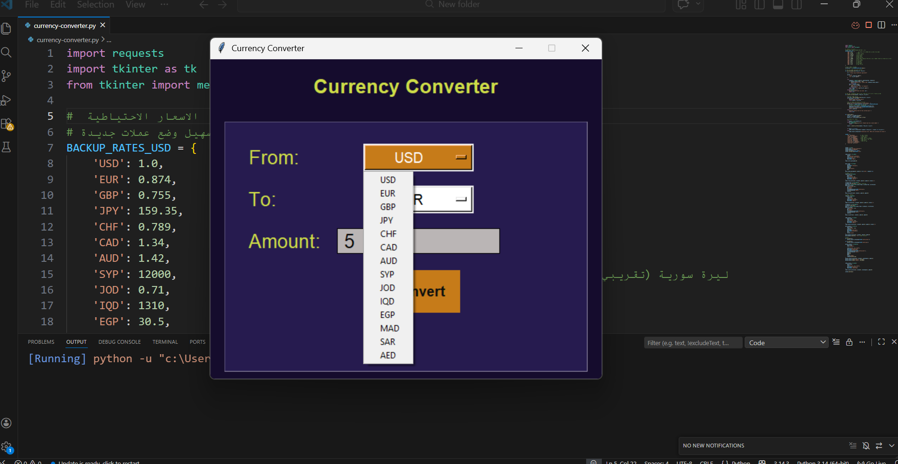
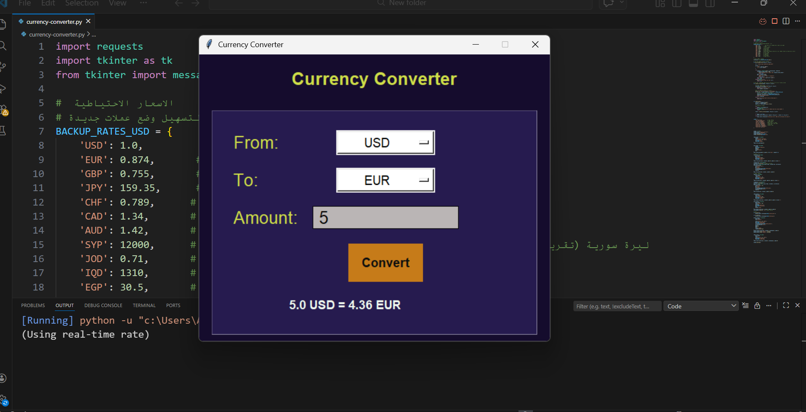

💱 Currency Converter Desktop

A lightweight, modern desktop application for currency conversion built with Python and Tkinter.
It fetches real-time exchange rates from the Frankfurter API - no API key required - and gracefully falls back to cached rates when offline
ensuring uninterrupted usability.

  
  

✨ Features

🌐 Live rates from Frankfurter API – always up‑to‑date when online.

💾 Fallback rates based on USD as the base currency (updated March 2026).

🏦 Supports 15+ currencies , including major global and Arab currencies:

World: USD , EUR , GBP , JPY , CHF , CAD , AUD

Arab: SYP (Syrian Pound) , JOD (Jordanian Dinar) , IQD (Iraqi Dinar) , EGP (Egyptian Pound) , MAD (Moroccan Dirham) , SAR (Saudi Riyal) , AED (UAE Dirham)

🎨 Modern dark theme 

🖱️ User-friendly interface – dropdown menus for currency selection and a large input field for amount.

🚦 Smart error handling – displays clear messages for invalid input or failed conversions.

🛠️ Technologies Used
Python 3.x

Tkinter – for the graphical user interface

Requests – for API calls

🔮 Future Features (In Development)

🌓 Light/Dark Theme Support 

🔄 Quick Currency Swap – A button to exchange the source and target currencies with one click.

📜 Conversion History – Save recent conversions and reuse them with a single click.

💾 Automatic Backup Rates Update – Update locally stored rates automatically when an internet connection is available.

📚 Through building this project , I learned:

🚀 Python fundamentals: writing functions , working with dictionaries and lists , error handling using try-except.

⚡ Working with APIs: fetching live data from the internet using the requests library , and parsing JSON.
 
🎨 GUI development: creating a complete desktop application using Tkinter , with a modern design.

📂 I paid great attention to organizing and structuring the code.

📄 License
This project is licensed under the MIT License – see the LICENSE file for details.

⭐ Show your support

Give a ⭐ if you like this project!
